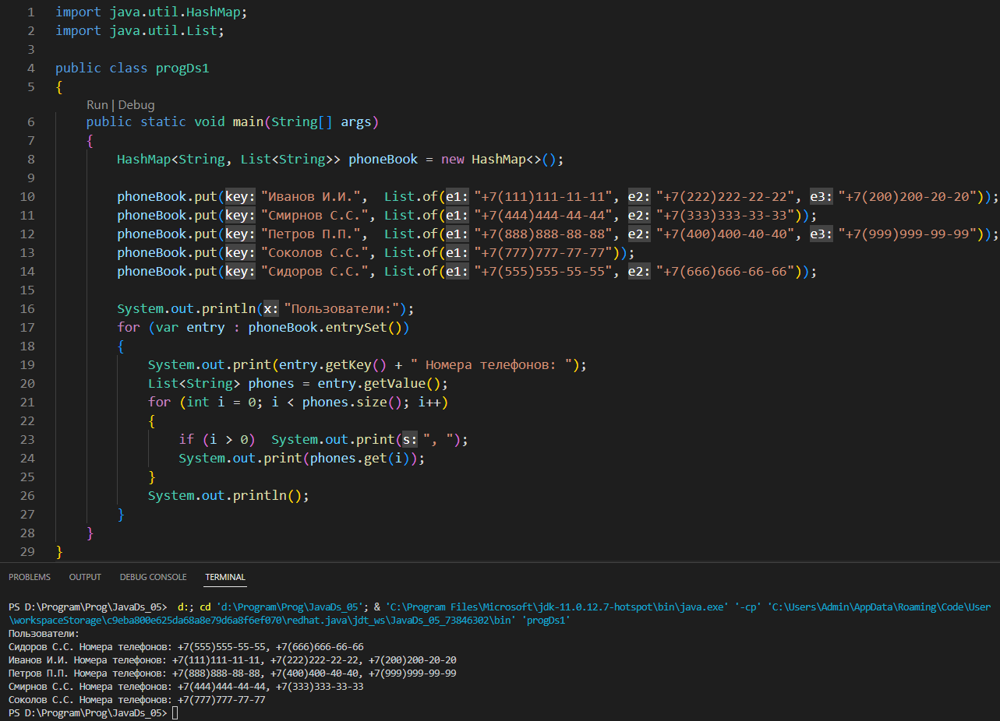
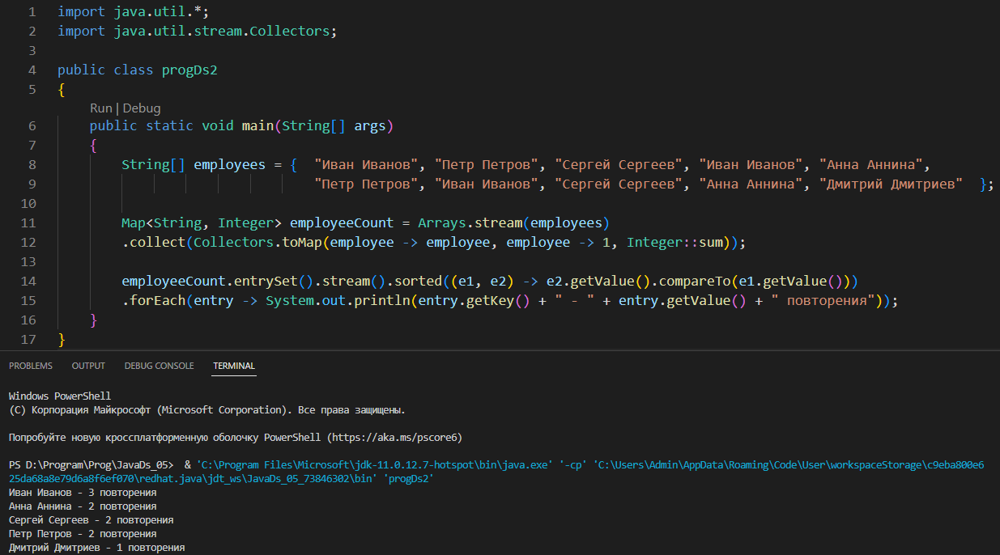
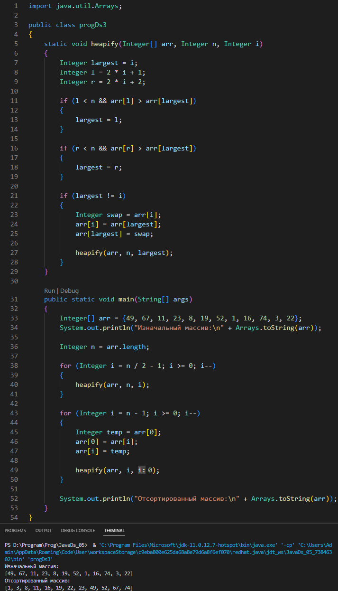
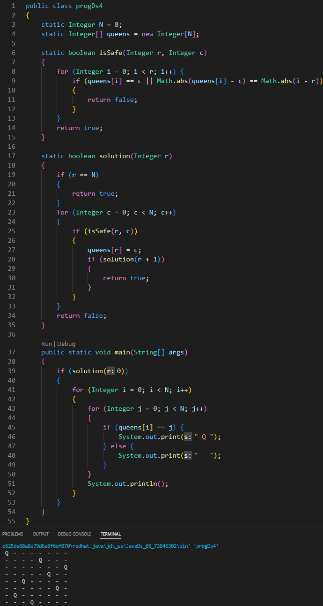

# Урок 4. Хранение и обработка данных ч1: приоритетные коллекции

## Задание 1
### Реализуйте структуру телефонной книги с помощью HashMap, учитывая, что 1 человек может иметь несколько телефонов.

## Задание 2
### Пусть дан список сотрудников: Иван Иванов ( и остальные, полный текст дз будет на платформе). Написать программу, которая найдет и выведет повторяющиеся имена с количеством повторений. Отсортировать по убыванию популярности.

## Задание 3
### Реализовать алгоритм пирамидальной сортировки (HeapSort).

## Задание 4
### На шахматной доске расставить 8 ферзей так, чтобы они не били друг друга.
